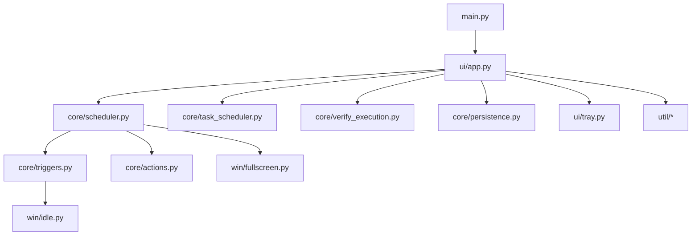

# PowerTimer

PowerTimer is a Windows 11 desktop utility that schedules power actions using multiple trigger types.

It supports:
- `Shutdown`, `Restart`, `Sleep`, `Hibernate`, `Lock`
- `Restart (Safe Mode minimal)` and `Restart (Safe Mode + Networking)`
- Triggering by countdown, specific clock time, process exit, CPU/disk/network idle, and user idle
- Optional `Survive exit` mode via Windows Task Scheduler

## Why this project fits a Data Engineer portfolio

This is not a data pipeline project, but it demonstrates engineering skills that transfer well to senior data/platform work:
- Stateful orchestration (`TaskConfig` + `ActiveTask` persisted to disk)
- Reliable background execution with cancellation semantics (threading + events)
- Separation of concerns (UI/core/platform layers)
- Operational visibility (structured logs + verification flow)
- Integration with external platform services (Windows Task Scheduler and Event Log)

## Architecture



Additional docs:
- Architecture details: [`docs/architecture.en.md`](docs/architecture.en.md)
- Module map: [`docs/modules.en.md`](docs/modules.en.md)
- Developer guide: [`guide/guide.en.md`](guide/guide.en.md)

## Quick start (dev)

### 1. Create environment

```powershell
python -m venv .venv
.\.venv\Scripts\Activate.ps1
pip install -r requirements.lock.txt
pip install -r requirements-dev.lock.txt
```

### 2. Run app

```powershell
python main.py
```

## Run tests

```powershell
python -m unittest discover -s tests -v
```

Note:
- UI/e2e tests are included and may be skipped automatically if Tk runtime is unavailable in the current environment.

## Build EXE

### Option A (recommended, reproducible): spec file

```powershell
pyinstaller --noconfirm --clean PowerTimer.spec
```

Output:
- `dist/PowerTimer/PowerTimer.exe`

### Option B: one-file build

```powershell
pyinstaller --noconfirm --clean --windowed --onefile --name PowerTimer --icon app.ico main.py
```

Output:
- `dist/PowerTimer.exe`

## Repository layout

```text
core/    # scheduler, triggers, actions, models, persistence, verification
ui/      # Tkinter UI, tray integration, dialogs
util/    # logging, paths, time formatting, single-instance helpers
win/     # Windows API helpers (idle/fullscreen)
docs/    # architecture and module docs
guide/   # concise developer guide
tests/   # unit tests
```

## Security and privacy

- No telemetry, no cloud calls, no account integration.
- Runtime data is local only:
  - `%LOCALAPPDATA%\PowerTimer\settings.json`
  - `%LOCALAPPDATA%\PowerTimer\powertimer.log`

## License

This repository is released under the MIT License. See [`LICENSE`](LICENSE).

Third-party dependency notes are documented in [`THIRD_PARTY_NOTICES.md`](THIRD_PARTY_NOTICES.md). PyInstaller is used under its GPLv2+ exception that permits distributing bundled executables.

## Project operations

- CI: [`.github/workflows/ci.yml`](.github/workflows/ci.yml)
- Security scans: [`.github/workflows/security.yml`](.github/workflows/security.yml)
- Automated dependency updates: [`.github/dependabot.yml`](.github/dependabot.yml)
- Release pipeline: [`.github/workflows/release.yml`](.github/workflows/release.yml)
- Changelog: [`CHANGELOG.md`](CHANGELOG.md)
- First release notes draft: [`RELEASE_NOTES_v1.0.0.md`](RELEASE_NOTES_v1.0.0.md)
- Release notes template: [`RELEASE_NOTES_TEMPLATE.md`](RELEASE_NOTES_TEMPLATE.md)
- Lockfile update script: [`scripts/update_lockfiles.ps1`](scripts/update_lockfiles.ps1)
- Contribution guide: [`CONTRIBUTING.md`](CONTRIBUTING.md)
- Security policy: [`SECURITY.md`](SECURITY.md)
