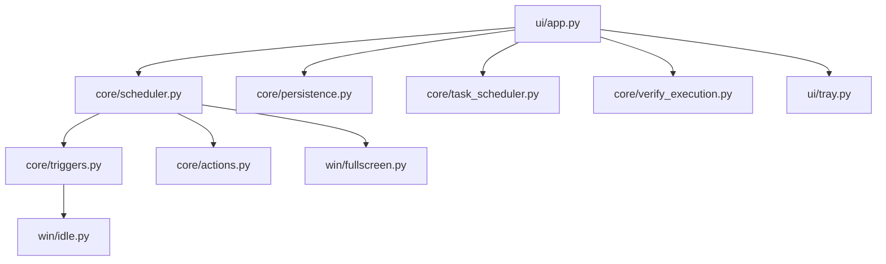

# PowerTimer Architecture

This document describes the runtime flow and major design decisions.

## 1. Layered structure

- `main.py`: startup, platform check, single-instance guard.
- `ui/`: Tkinter window, tray icon, dialogs, user interactions.
- `core/`: task model, scheduling, trigger evaluation, action execution, persistence, verification.
- `util/` and `win/`: logging, paths, icon helpers, and Windows API wrappers.

## 2. End-to-end task lifecycle

1. User selects action and trigger in `ui/app.py`.
2. UI builds `TaskConfig` and creates `ActiveTask`.
3. Task is persisted to `%LOCALAPPDATA%\PowerTimer\settings.json`.
4. `core.scheduler.Scheduler` starts a background worker thread.
5. Trigger resolves to a fire time or blocking condition.
6. Final countdown (up to 30s) exposes an abort dialog.
7. Optional fullscreen guard delays execution.
8. `core.actions.execute_action` calls Windows commands/APIs.
9. Task status and evidence are written back to settings and logs.

## 3. Concurrency model

- UI runs on the main Tk thread.
- Scheduler runs in one daemon thread.
- Cross-thread communication uses:
  - callback hooks (`on_tick`, `on_done`, `on_abort_request`)
  - UI queue (`queue.Queue`) for safe widget updates

This avoids direct widget access from worker threads.

## 4. Survive-exit mode

Supported triggers:
- `Countdown`
- `At time (HH:MM)`

Flow:
1. UI computes absolute `run_at` time.
2. `core.task_scheduler` generates Task Scheduler XML.
3. `schtasks /create` registers a one-shot task.
4. Task name is stored in `ActiveTask.scheduled_task_name`.

If the app exits, Windows Task Scheduler still executes the action.

## 5. Verification strategy

On startup, the app can verify previous tasks:
- Task Scheduler metadata (`Get-ScheduledTaskInfo`)
- Event logs (`wevtutil` queries by action-specific event IDs)

Result is persisted as:
- `yes`
- `likely`
- `no`
- `unknown`

## 6. Runtime artifacts

- Settings and active task:
  - `%LOCALAPPDATA%\PowerTimer\settings.json`
- Logs:
  - `%LOCALAPPDATA%\PowerTimer\powertimer.log`
- Temporary Task Scheduler XML:
  - `%LOCALAPPDATA%\PowerTimer\_taskxml\`

## 7. Failure handling

- Scheduler exceptions set task status to `stale` with an error note.
- UI surfaces recoverable errors with dialogs and status text.
- External command failures (Task Scheduler, Event Log, `bcdedit`) are logged.

## 8. High-level dependency graph

